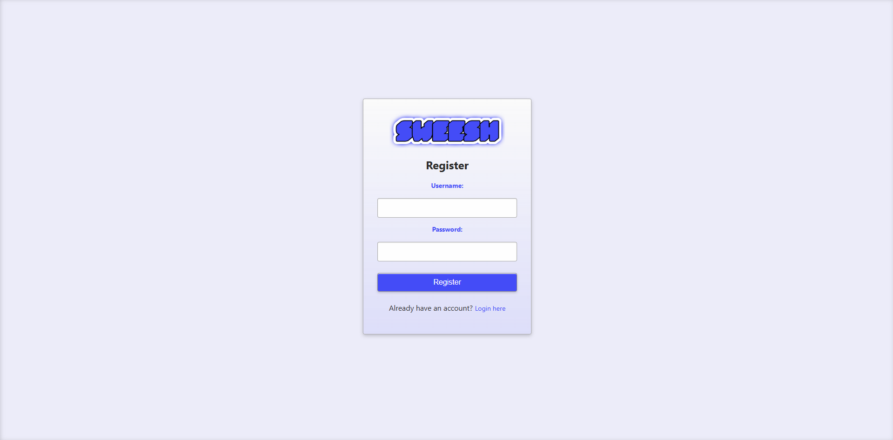
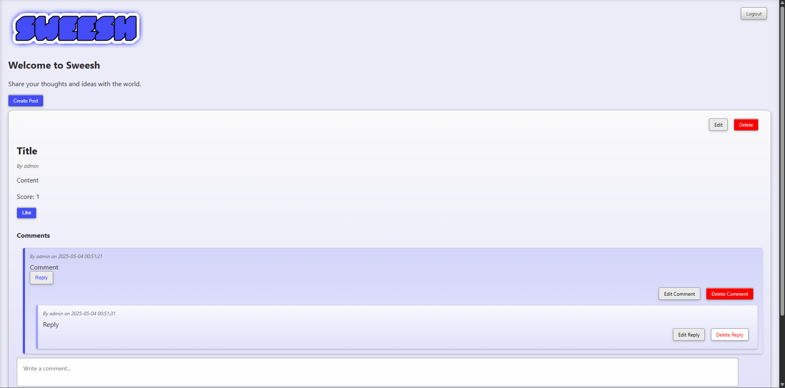

# Sweesh

**Sweesh** is a project I’ve been developing using AI language models and the LAMP stack. I set up a Linux server in my homelab and use SSH through Visual Studio Code on my PC for development. I'm building Sweesh to deepen my understanding of web development, server and database setup, and foundational protocols such as SSH, FTP, HTTP, etc.

Sweesh is a thread-style social media web app built in PHP for the LAMP stack. It features threaded comments, "Like" mechanics, and interactive post options. The main purpose of Sweesh is to help learn, create, and share with others who might benefit from the project.

---


---

## 🚀 Features

- 📝 Post creation and discussion threads
- 💬 Threaded and nested comment system
- 🔺 Upvote support for posts
- 👤 Account creation and login system
- 📜 Show more / show less toggles for long threads
- 📊 Post sorting by vote count
  
---

## 📷 Screenshots






---

## 🛠 Installation

### Requirements

- Apache2
- PHP 7.4+ (or PHP 8.x)
- MySQL
- LAMP stack setup

### Setup

1. **Clone the repo**

   ```bash
   git clone https://github.com/evan-mcelroy/sweesh.git

2. **Move the project to your web server directory**
   
   ```bash
   sudo mv sweesh /var/www/html/

3. **Set correct permissions**

      ```bash
      sudo chown -R www-data:www-data /var/www/html/sweesh
      sudo chmod -R 755 /var/www/html/sweesh

4. **Create the MySQL database**

      ```bash
      CREATE DATABASE sweesh_db;
      USE sweesh_db;
      CREATE DATABASE IF NOT EXISTS sweesh_db;
      USE sweesh_db;
      
      -- Users table
      CREATE TABLE IF NOT EXISTS users (
          id INT AUTO_INCREMENT PRIMARY KEY,
          username VARCHAR(50) NOT NULL UNIQUE,
          password VARCHAR(255) NOT NULL,
          email VARCHAR(100),
          created_at TIMESTAMP DEFAULT CURRENT_TIMESTAMP
      );
      
      -- Posts table
      CREATE TABLE IF NOT EXISTS posts (
          id INT AUTO_INCREMENT PRIMARY KEY,
          user_id INT NOT NULL,
          title VARCHAR(255) NOT NULL,
          content TEXT NOT NULL,
          created_at TIMESTAMP DEFAULT CURRENT_TIMESTAMP,
          FOREIGN KEY (user_id) REFERENCES users(id) ON DELETE CASCADE
      );
      
      -- Comments table
      CREATE TABLE IF NOT EXISTS comments (
          id INT AUTO_INCREMENT PRIMARY KEY,
          post_id INT NOT NULL,
          user_id INT NOT NULL,
          comment_text TEXT NOT NULL,
          created_at TIMESTAMP DEFAULT CURRENT_TIMESTAMP,
          FOREIGN KEY (post_id) REFERENCES posts(id) ON DELETE CASCADE,
          FOREIGN KEY (user_id) REFERENCES users(id) ON DELETE CASCADE
      );
      
      -- Replies table
      CREATE TABLE IF NOT EXISTS replies (
          id INT AUTO_INCREMENT PRIMARY KEY,
          comment_id INT NOT NULL,
          user_id INT NOT NULL,
          reply_text TEXT NOT NULL,
          created_at TIMESTAMP DEFAULT CURRENT_TIMESTAMP,
          FOREIGN KEY (comment_id) REFERENCES comments(id) ON DELETE CASCADE,
          FOREIGN KEY (user_id) REFERENCES users(id) ON DELETE CASCADE
      );
      
      -- Votes table
      CREATE TABLE IF NOT EXISTS votes (
          id INT AUTO_INCREMENT PRIMARY KEY,
          post_id INT NOT NULL,
          user_id INT NOT NULL,
          vote_type ENUM('up', 'down') NOT NULL,
          created_at TIMESTAMP DEFAULT CURRENT_TIMESTAMP,
          FOREIGN KEY (post_id) REFERENCES posts(id) ON DELETE CASCADE,
          FOREIGN KEY (user_id) REFERENCES users(id) ON DELETE CASCADE,
          UNIQUE(post_id, user_id)
      );

5. **Configure database credentials**

   ```bash
   sudo nano /var/www/html/sweesh/sweesh/config.php

6. **Restart Apache**

    ```bash
    sudo systemctl restart apache2

8. **Access Sweesh**

    ```bash
     http://<your-server-ip>/sweesh

---

   ## 📄 License

   Sweesh is licensed under the MIT License.

   For full license details, see [LICENSE](https://github.com/evan-mcelroy/sweesh/blob/main/LICENSE) in this repository

---

   ## 🙌 Contributing

Pull requests are welcome! If you’d like to contribute:

   - Fork the repo

   - Create a feature branch

   - Commit changes with clear messages

   - Submit a pull request

Ideas, improvements, and feedback are always appreciated.

---
